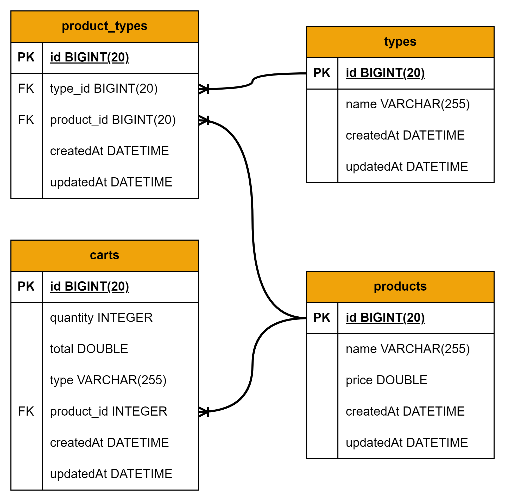

# Simple Order System (Technical Test)

## Overview

Simple Order System adalah aplikasi Spring Boot yang menyediakan API untuk mengelola produk dan keranjang belanja. Aplikasi ini mendukung operasi CRUD untuk produk dan keranjang belanja, serta menyediakan fitur untuk menambahkan item ke dalam keranjang.

## Requirements

- Java 11 atau lebih tinggi
- Maven
- PostgreSQL

## Installation

1. Clone repository ini

   ```bash
   git clone https://github.com/hackim18/simple-order-system
   ```

2. Pindah ke direktori proyek

   ```bash
   cd back-end-spring-boot-java
   ```

3. Buat database PostgreSQL

   ```sql
   CREATE DATABASE simple_order_system_spring_boot;
   ```

4. Ubah konfigurasi database di `application.properties`

   ```properties
   spring.datasource.url=jdbc:postgresql://localhost:5432/simple_order_system_spring_boot
   spring.datasource.username=yourusername
   spring.datasource.password=yourpassword
   spring.jpa.hibernate.ddl-auto=update
   ```

5. Jalankan aplikasi

   ```bash
   mvn spring-boot:run
   ```

## API Endpoints

### Products

- **GET /products**: Mendapatkan semua produk dengan pagination

  - **Request Params**:
    - `page` (default: 0): Nomor halaman.
    - `size` (default: 10): Jumlah item per halaman.

### Carts

- **GET /carts**: Mendapatkan semua item di keranjang belanja

- **POST /carts/add**: Menambahkan item ke keranjang belanja

  - **Request Body**:
    ```json
    {
      "productId": 1,
      "quantity": 2,
      "type": "laptop"
    }
    ```

- **DELETE /carts/{id}**: Menghapus item dari keranjang belanja berdasarkan ID
  - **Path Variable**:
    - `id`: ID item di keranjang belanja.

## Database Schema



### Tabel Products

| Column    | Type         | Description                 |
| --------- | ------------ | --------------------------- |
| id        | BIGINT(20)   | Primary Key, Auto Increment |
| name      | VARCHAR(255) | Nama produk                 |
| price     | DOUBLE       | Harga produk                |
| createdAt | DATETIME     | Waktu pembuatan             |
| updatedAt | DATETIME     | Waktu pembaruan             |

### Tabel Carts

| Column     | Type         | Description                 |
| ---------- | ------------ | --------------------------- |
| id         | BIGINT(20)   | Primary Key, Auto Increment |
| product_id | BIGINT(20)   | Foreign Key to Products     |
| quantity   | INT          | Jumlah item                 |
| total      | DOUBLE       | Total harga                 |
| type       | VARCHAR(255) | Tipe item                   |
| createdAt  | DATETIME     | Waktu pembuatan             |
| updatedAt  | DATETIME     | Waktu pembaruan             |

### Tabel Types

| Column    | Type         | Description                 |
| --------- | ------------ | --------------------------- |
| id        | BIGINT(20)   | Primary Key, Auto Increment |
| name      | VARCHAR(255) | Nama tipe                   |
| createdAt | DATETIME     | Waktu pembuatan             |
| updatedAt | DATETIME     | Waktu pembaruan             |

### Tabel Product_Types

| Column     | Type       | Description                 |
| ---------- | ---------- | --------------------------- |
| id         | BIGINT(20) | Primary Key, Auto Increment |
| product_id | BIGINT(20) | Foreign Key to Products     |
| type_id    | BIGINT(20) | Foreign Key to Types        |
| createdAt  | DATETIME   | Waktu pembuatan             |
| updatedAt  | DATETIME   | Waktu pembaruan             |

## Testing API

Untuk menguji API, Anda bisa menggunakan Postman atau alat serupa.

### Contoh Pengujian dengan Postman

#### Mendapatkan Semua Produk

1. Metode: `GET`
2. URL: `http://localhost:8080/products`
3. Params:
   - page: 0 (default)
   - size: 10 (default)

#### Mendapatkan Semua Item di Keranjang

1. Metode: `GET`
2. URL: `http://localhost:8080/carts`

#### Tambahkan Item ke Keranjang

1. Metode: `POST`
2. URL: `http://localhost:8080/carts/add`
3. Body (raw, JSON):
   ```json
   {
     "productId": 1,
     "quantity": 2,
     "type": "laptop"
   }
   ```

#### Hapus Item dari Keranjang

1. Metode: `DELETE`
2. URL: `http://localhost:8080/carts/{id}`
3. Path Variable:
   - id: ID item di keranjang belanja.
